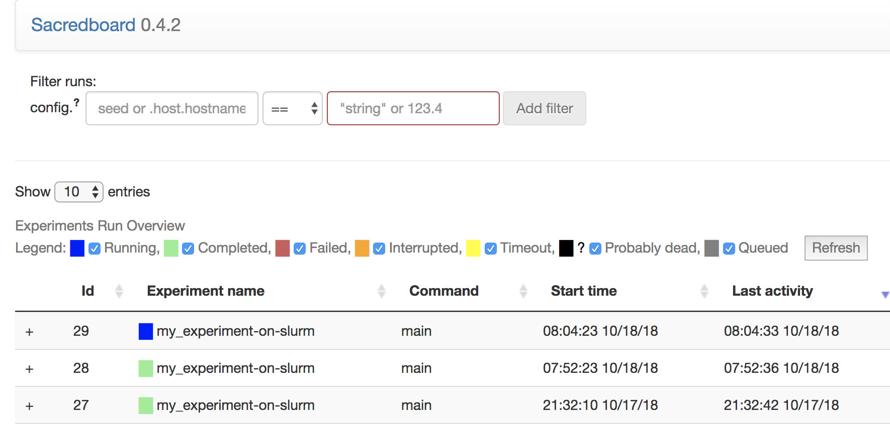

# Sacred Example Code Pytorch

To just quote its [documentation](https://sacred.readthedocs.io): ‘Sacred is a tool to 
configure, organize, log and reproduce computational experiments’. Sacred's
[documentation](https://sacred.readthedocs.io) itself is great. However, I figured some nice
sample code was missing, that shows you how you run a full project. 

In this repo you can find the code for a very simple feed forward neural network in Pytorch,
where we make use of Sacred. The code is based on [Yunjey's code](https://github.com/yunjey/pytorch-tutorial/tree/master/tutorials/01-basics/feedforward_neural_network), 
but quite heavily adapted for the current example. All the lines that are there for Sacred
are commented with ```#sacred```.

## Usage 

### To just run from the command line

```
python train_nn.py with num_epochs=10
```

### To run with a job file on a cluster that uses Slurm

```
sbatch train_nn.job
```

#### Changing parameters
Sacred allows you to change your configuration in several ways. You can have al look at the 
[documentation](https://sacred.readthedocs.io/en/latest/configuration.html#updating-config-entries)
for a full overview of how to do this. 

Here we use the update from the command line. In the code ```num_epochs=2```, whereas we want
to update it to ```num_epochs=10```. From the command line you can do this by using 
```with```, followed by your update. In a job file you need to make sure to put your *full*
 parameter update between quotation marks in case of integers: ```with 'num_epochs=10'```, as 
 otherwise your parameter is not recognized as an integer.
 
 #### Importing experiments
 In some cases you may want to use a Sacred experiment in a new file. You can do this by
 importing it. An example for how that would go with the current setup:
 
```
import train_nn
ex = train_nn.ex
```

Then you can use your ```ex``` as you're used to.


## Sacredboard
You display all your results with [Sacredboard](https://github.com/chovanecm/sacredboard).
To run Sacredboard for the current setup:

```
sacredboard -m my-database
```

### Some examples

##### Overview of some runs


##### Overview of config


##### Overview of config


##### Overview of config

